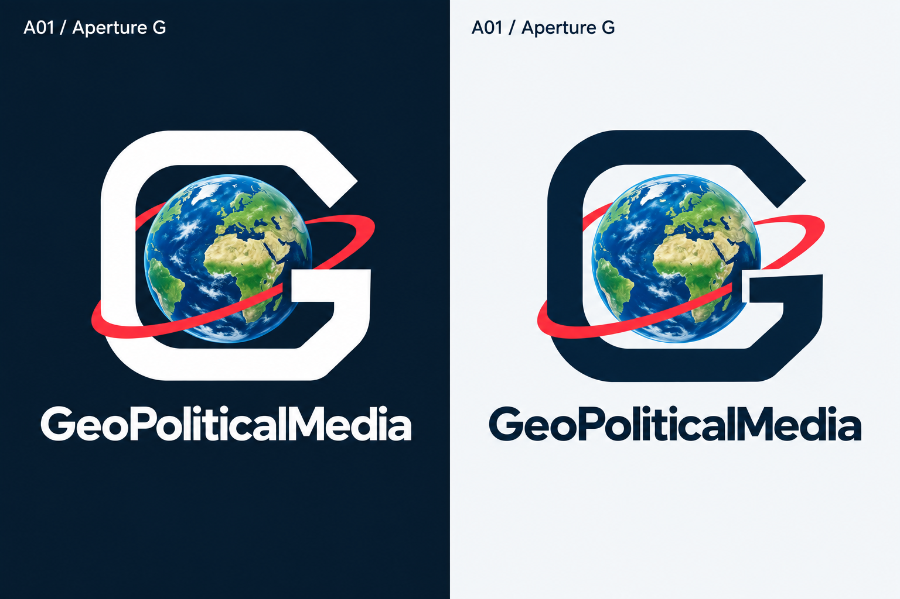
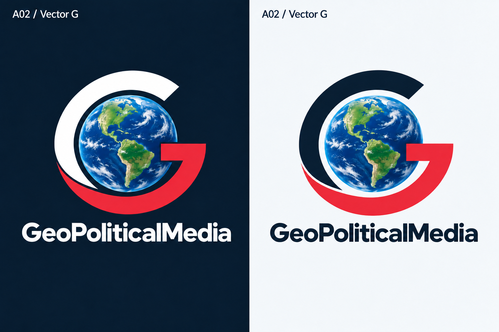
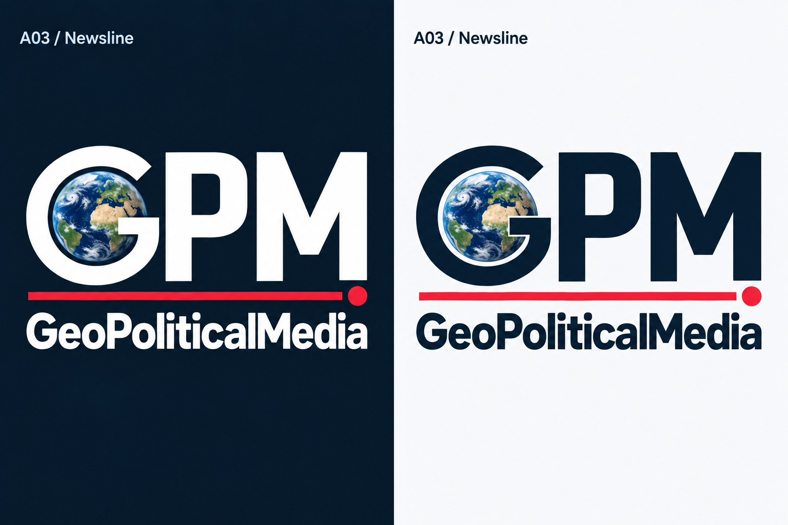
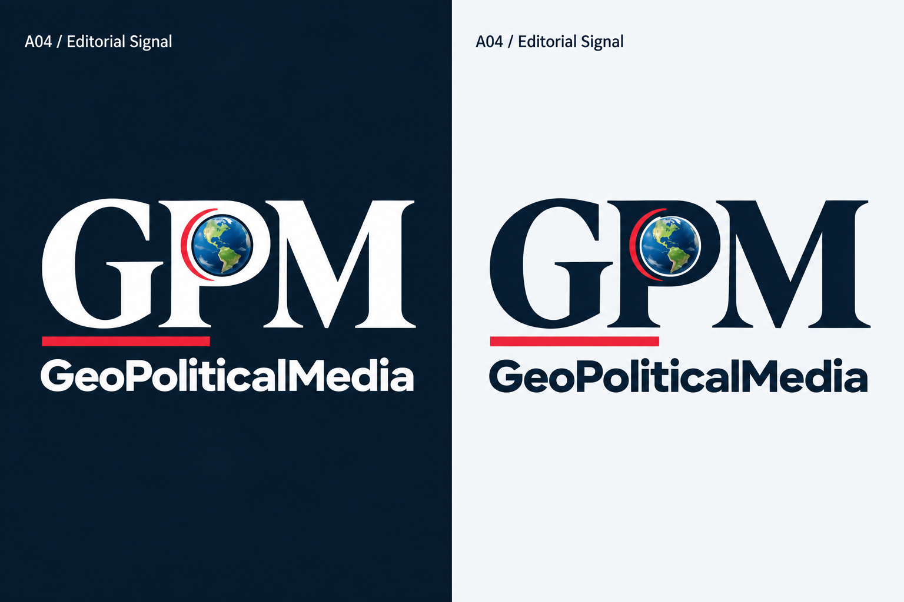

# Alternate GeoPoliticalMedia Logo Concepts

Four new directions built from the Earth, red accent, and G/GPM identities in the [preserved PoC collection](../poc/README.md). Each PNG board pairs a dark default on the left with a light alternate on the right.

| Concept | New direction | Character |
| --- | --- | --- |
| A01 — Aperture G | A compact rounded-square G around the Earth | Bold, precise, suited to an avatar |
| A02 — Vector G | Red becomes part of the G itself | Simple, energetic, immediately recognizable |
| A03 — Newsline | Earth moves into the G of a condensed GPM monogram | Clear, assertive, built around typography |
| A04 — Editorial Signal | Contemporary serif GPM with a small orbital accent | Authoritative, distinctive, editorial |

## A01 — Aperture G

The familiar circular G becomes a rounded-square frame with a deliberate open aperture. A slim red orbit and a round Earth preserve the family resemblance while the compact outer shape gives it a different silhouette.

## A02 — Vector G

A solid red lower arm and crossbar become part of the G. The emphasis shifts from a decorative orbit to a stronger two-tone symbol, with the Earth clearly contained inside it.

## A03 — Newsline

The larger Earth moves from the P into the G. More condensed lettering and a straight red baseline give the full GPM mark a sharper broadcast identity, with uninterrupted P and M shapes.

## A04 — Editorial Signal

Contemporary serif capitals give GPM a publication-style identity. The Earth stays inside a conventionally proportioned P; a restrained red arc and editorial rule replace the large sweeping orbit.

Generated with the built-in image_gen tool as PNG concept boards. [Exact prompts and references](prompts.md) · [PoC gallery](../poc/README.md) · [All concept stages](../README.md).
