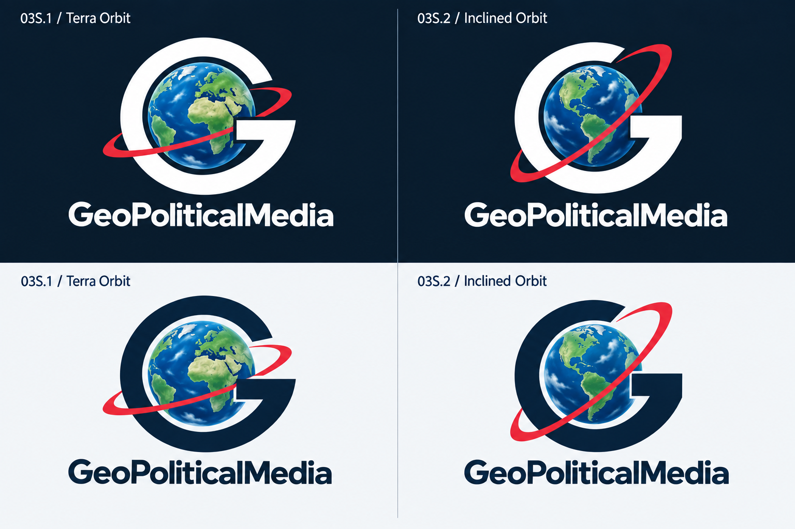
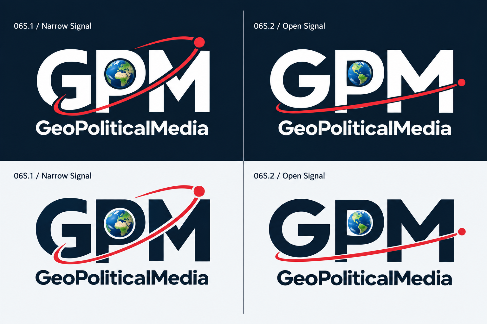
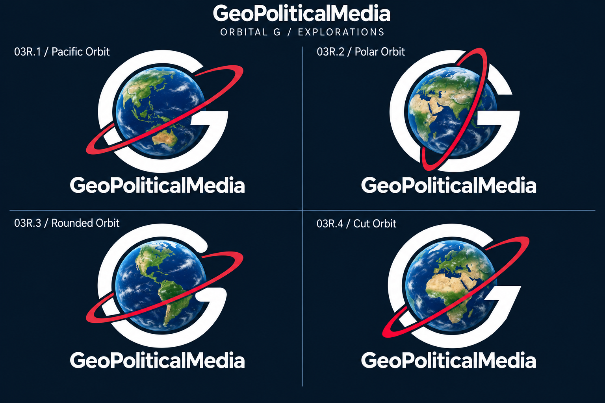
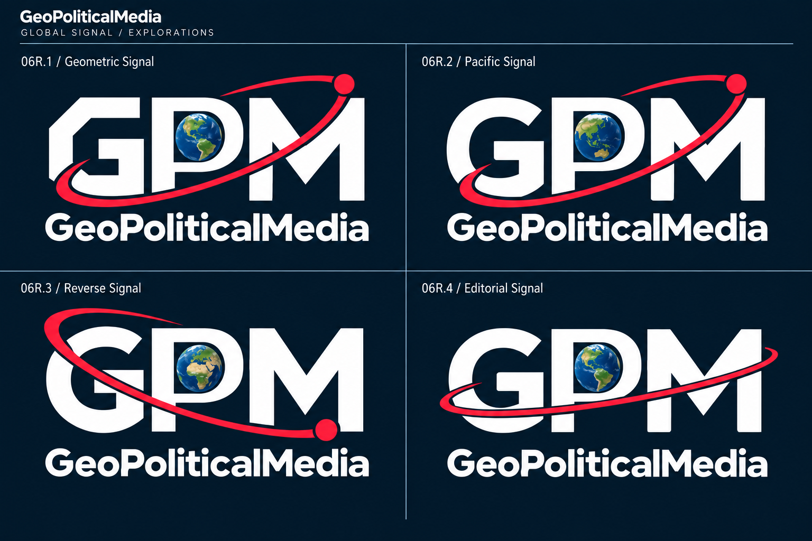
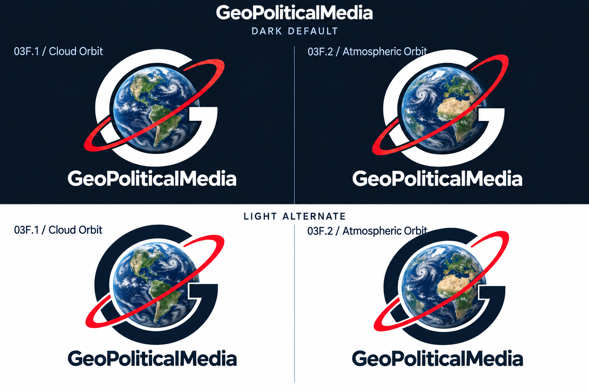
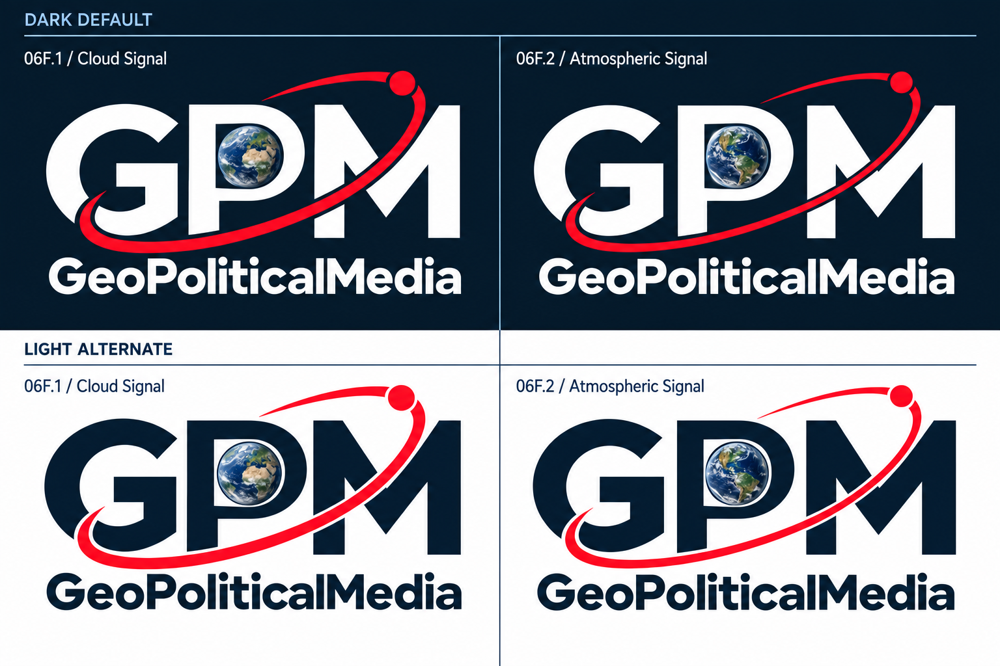

# Finalizing Logo Concepts

Refinements of the Orbital G and Global Signal families, with red rings and blue-green Earths. The newest round adds four examples with dark and light presentations, followed by the earlier eight dark-background explorations and cloud studies.

## Additional Orbital G Variants

- **03S.1 — Terra Orbit:** an open circular G, Atlantic-facing Earth, and a shallow red ring
- **03S.2 — Inclined Orbit:** a heavier, compact G with squared terminals, the Americas, and a steeper red ring

## Additional Global Signal Variants

- **06S.1 — Narrow Signal:** slightly condensed GPM proportions and an ascending red orbit with a signal dot
- **06S.2 — Open Signal:** wider GPM proportions, a smaller Earth inset, and a shallow red orbit

The globes use blue oceans, green land, simplified terrain, and soft shading. The dark and light panels are concept alternates; final vector geometry remains a later refinement.

[Exact prompts for these four examples](geopoliticalmedia-additional-variants-prompts.md)

## Earlier Orbital G Explorations

- **03R.1 — Pacific Orbit:** Asia-Pacific Earth with a slender ascending ring
- **03R.2 — Polar Orbit:** a steep red orbit and Eurasia/Indian Ocean view
- **03R.3 — Rounded Orbit:** softer G terminals, a shallower ring, and the Americas
- **03R.4 — Cut Orbit:** angled G terminals, a fine ring, and Europe/Africa

## Earlier Global Signal Explorations

- **06R.1 — Geometric Signal:** angular lettering and a circular Earth in the P
- **06R.2 — Pacific Signal:** softer letterforms and an Asia-Pacific globe
- **06R.3 — Reverse Signal:** a descending orbit with its red dot at lower right
- **06R.4 — Editorial Signal:** a compact, shallow orbit without a terminal dot

[Exact prompts for all eight new examples](geopoliticalmedia-red-ring-explorations-prompts.md)

## Earlier Cloud Orbit Studies

- **03F.1 — Cloud Orbit:** the Americas with visible cloud bands and natural terrain
- **03F.2 — Atmospheric Orbit:** Europe, Africa, and the Atlantic with cloud swirls and a steeper orbit

[Exact imagegen prompt](geopoliticalmedia-cloud-orbit-prompts.md)

## Earlier Cloud Signal Studies

- **06F.1 — Cloud Signal:** Europe and Africa inside a conventionally proportioned P
- **06F.2 — Atmospheric Signal:** the Americas, a finer orbit, and more open letter spacing

[Exact imagegen prompt](geopoliticalmedia-cloud-signal-prompts.md)

Generated with the built-in imagegen tool. These are raster refinements for review, not a declared final brand selection.

[Intermediate refinements](../intermediate/README.md) · [All stages](../README.md)
