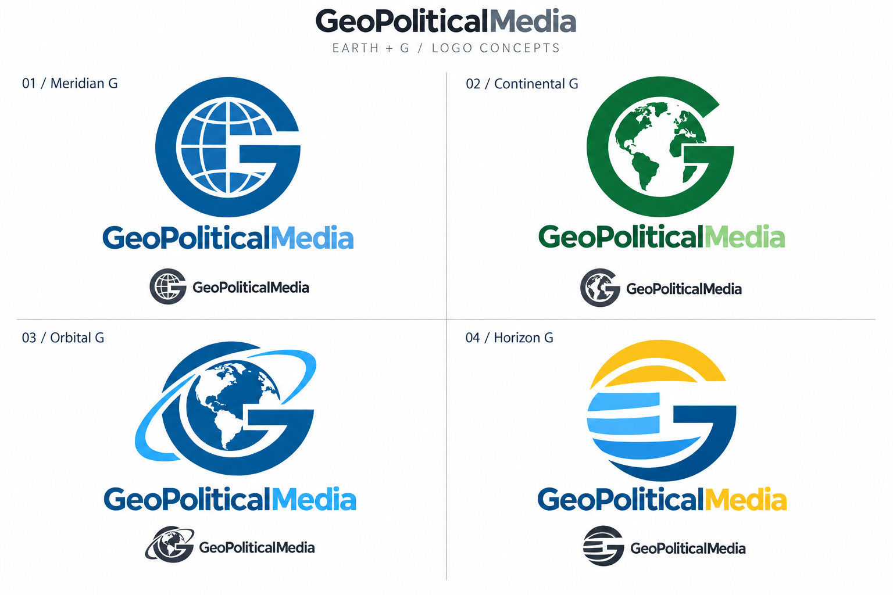
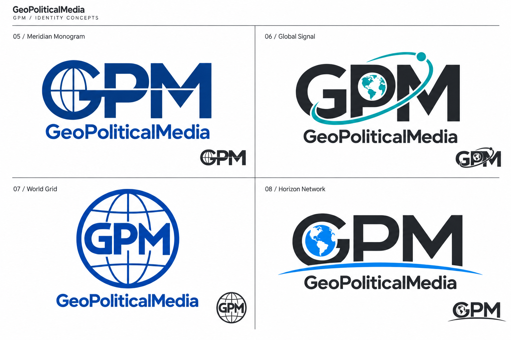

# Initial Logo Concepts

The first eight directions, before the red-ring, dark-theme, typography, and realism refinements. Original PNGs and exact imagegen prompts are preserved together.

## Earth + G

01 Meridian G · 02 Continental G · 03 Orbital G · 04 Horizon G

[Exact prompts](geopoliticalmedia-earth-g-prompts.md)

## GPM

05 Meridian Monogram · 06 Global Signal · 07 World Grid · 08 Horizon Network

[Exact prompts](geopoliticalmedia-gpm-prompts.md) · [All stages](../README.md)
